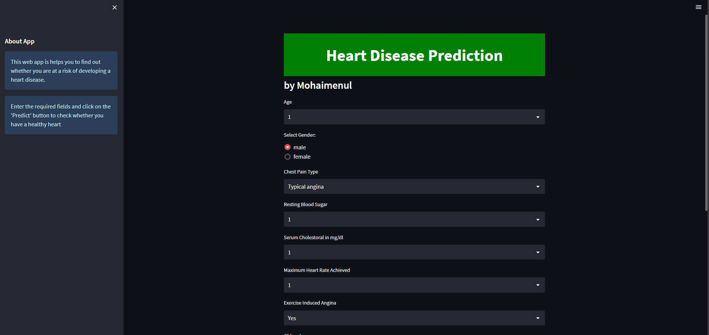
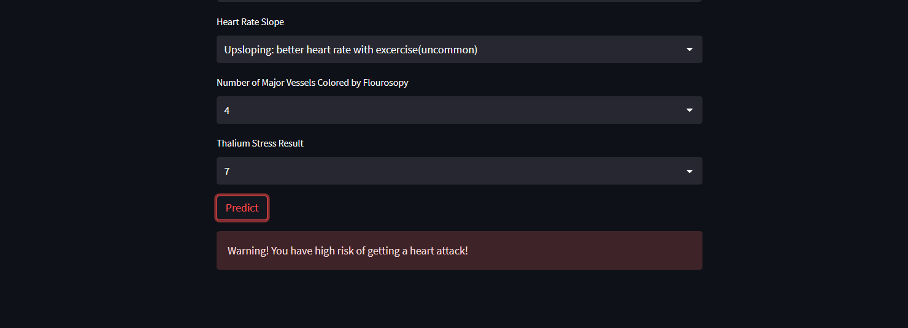

# Heart-Disease-Prediction-Website
Heart Disease Prediction Website with ANN

# Heart Disease Prediction Website
Heart disease is one of the leading causes of death worldwide. Therefore, accurate and early diagnosis of cardiac diseases is highly required. This paper proposes a deep learning-based approach for cardiac disease prediction using a complex Artificial Neural Network (ANN) model. Our proposed model achieves high accuracy by using various data preprocessing techniques, such as feature scaling, used to normalize the scale of input features, and label encoding, used to convert all categorical variables into numerical values. The overfitting problem is reduced by including multiple hidden layers, batch normalization, and a dropout regularizer in our model architecture so that it can generalize well with new, unseen data samples. Furthermore, we evaluate our proposed model on publicly available datasets to investigate its capability, along with training- validation impact analysis, which shows that our proposed model has good training as well as testing behavior with high accuracy classification and low validation loss obtained. This paper reported a scalable, automated, and highly accurate method developed based on deep ANN for early detection of heart disease, which highlights the practical applicability and potential associated with the use of such modern deep learning based solutions in predictive healthcare systems.

# Predicted heart disease using various machine learning algorithms:
• Logistic Regression (LR)  
• Naive Bayes (NB)  
• Support Vector Machine (SVM)  
• k-Nearest Neighbors (KNN)  
• Artificial Neural Network (ANN)  
• Convolutional Neural Network (CNN)   

# Achieved impressive testing accuracy:
• ANN-based model: Approximately 98.54%  
• Second-best model: CNN with an accuracy of 96.58%  

# Utilized Boruta feature selection technique:
• Reduced features from 13 to 10, a 15.38% reduction.  
• Maintained ANN model accuracy at 98.54%.  

# Output

